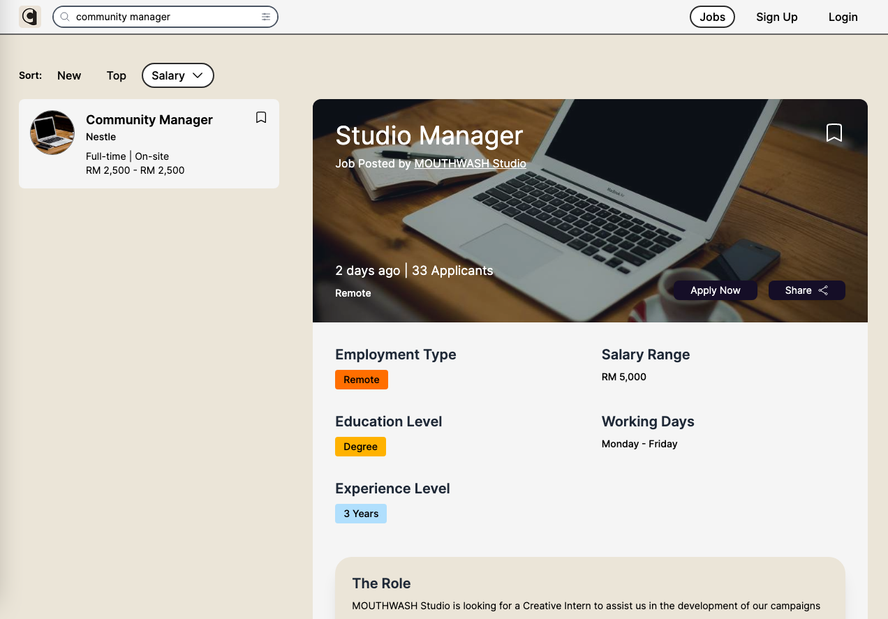

This is a [Next.js](https://nextjs.org/) project bootstrapped
with [`create-next-app`](https://github.com/vercel/next.js/tree/canary/packages/create-next-app).

## Welcome to CCwebapp

Ccwebapp is a 🗄 Simple Job Listing Landing Page example powered by NextJs and Firebase

## Installation Steps

Run the command below to clone and install dependencies

```bash
git clone https://github.com/densityx/ccwebapp.git

npm install
```

To run the development server use the `npm run dev` command

```bash
npm run dev
```

## Production

To view the project published in production visit the link below

- [Vercel](https://ccwebapp.vercel.app/)

## Screenshots Preview



<div style="display: flex;">


</div>
